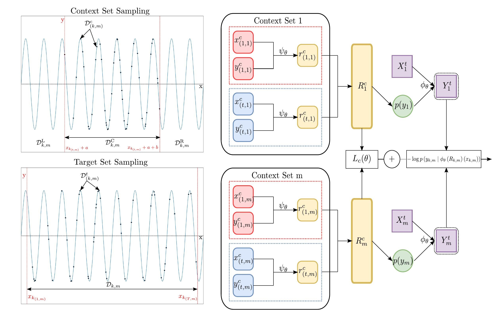

# Contrastive Neural Processes
PyTorch implementation of "[Contrastive Neural Processes for Self-Supervised Learning](https://arxiv.org/abs/2110.13623)"

<p align="center">
  
</p>

## Implementation Details

This folder includes the code for Contrastive Neural Processes and Baselines.
Code has been modified accordingly to the needs of the project. Original sources are cited here:

Folders:
- Baselines : Includes all baselines, hyperparameters and evaluation metrics used for base experiments
- ContrNP : Includes code for ContrNP method and resources
- Results : Location where weights and results are saved
- Data : Location where datasets are located. Use *data_name*_load.py to download and extract data. 
(Please Note: Some commands for data extraction are Ubuntu specific)


Baselines includes implementations for Tloss [[1]](https://github.com/White-Link/UnsupervisedScalableRepresentationLearningTimeSeries), CPC [[2]](https://openreview.net/forum?id=8qDwejCuCN), TNC [[2]](https://openreview.net/forum?id=8qDwejCuCN) and SimCLR [[3]](https://github.com/Spijkervet/SimCLR).

Folders: npf, utils are for the implementation of Neural Processes [[4]](https://github.com/YannDubs/Neural-Process-Family).
- Main Implementation of contrastive convolutional cnp: Contrastive-ConvCNP-SSL.ipynb
- Implementation of Self supervised convolutional cnp: ConvCNP-SSL.ipynb
- Implementation of Self supervised cnp: CNP-SSL.ipynb

## Citing this work


[[arXiv]](https://arxiv.org/abs/2110.13623) [[PMLR]](https://proceedings.mlr.press/v157/kallidromitis21a) [[ACML2021]](http://www.acml-conf.org/2021/conference/accepted-papers/266/) 

```
@misc{kallidromitis2021contrastive,
      title={Contrastive Neural Processes for Self-Supervised Learning}, 
      author={Konstantinos Kallidromitis and Denis Gudovskiy and Kazuki Kozuka and Ohama Iku and Luca Rigazio},
      year={2021},
      eprint={2110.13623},
      archivePrefix={arXiv},
      primaryClass={cs.LG}
}
```
## Reproduced Results

<table>
    <thead>
        <tr>
            <th></th>
            <th colspan=2>AFDB</th>
            <th colspan=2>IMS Bearing</th>
            <th colspan=2>Urban8K</th>
        </tr>
    </thead>
    <tbody>
        <tr>
            <td><b>Method</b></td>
            <td>Accuracy</td>
            <td>AUPRC</td>
            <td>Accuracy</td>
            <td>AUPRC</td>
            <td>Accuracy</td>
            <td>AUPRC</td>
        </tr>
        <tr>
            <td>CPC</td>
            <td>71.6</td>
            <td>62.6</td>
            <td>72.4</td>
            <td>84.4</td>
            <td>83.3</td>
            <td>94.5</td>
        </tr>
        <tr>
            <td>Tloss</td>
            <td>74.8</td>
            <td>59.8</td>
            <td>73.2</td>
            <td>87.6</td>
            <td>81.5</td>
            <td>93.8</td>
        </tr>
        <tr>
            <td>TNC</td>
            <td>74.5</td>
            <td>56.3</td>
            <td>70.3</td>
            <td>86.3</td>
            <td>80.7</td>
            <td>93.9</td>
        </tr>
        <tr>
            <td>SimCLR</td>
            <td>82.3</td>
            <td>71.5</td>
            <td>41.5</td>
            <td>70.7</td>
            <td>82.8</td>
            <td>94.1</td>
        </tr>
        <tr>
            <td><b>ContrNP (ours)</b></td>
            <td><b>94.2</b></td>
            <td><b>89.1</b></td>
            <td><b>73.6</b></td>
            <td><b>89.3</b></td>
            <td><b>84.2</b></td>
            <td><b>95.4</b></td>
        </tr>
        <tr>
            <td>Fully supervised</td>
            <td>98.4</td>
            <td>81.6</td>
            <td>86.3</td>
            <td>94.8</td>
            <td>99.9</td>
            <td>99.9</td>
        </tr> 
    </tbody>
</table>

<table>
    <thead>
        <tr>
            <th></th>
            <th colspan=4>AFDB</th>
            <th colspan=4>IMS Bearing</th>
            <th colspan=4>Urban8K</th>
        </tr>
    </thead>
    <tbody>
        <tr>
            <td><b>Method</b></td>
            <td>Accuracy</td>
            <td>AUPRC</td>
            <td>Sil↑</td>
            <td>DBI↓</td>
            <td>Accuracy</td>
            <td>AUPRC</td>
            <td>Sil↑</td>
            <td>DBI↓</td>
            <td>Accuracy</td>
            <td>AUPRC</td>
            <td>Sil↑</td>
            <td>DBI↓</td>
        </tr>
        <tr>
            <td>CPC</td>
            <td>71.6</td>
            <td>62.6</td>
            <td>0.22</td>
            <td>1.74</td>
            <td>72.4</td>
            <td>84.4</td>
            <td>0.12</td>
            <td>2.20</td>
            <td>83.3</td>
            <td>94.5</td>
            <td>0.24</td>
            <td>1.64</td>
        </tr>
        <tr>
            <td>Tloss</td>
            <td>74.8</td>
            <td>59.8</td>
            <td>0.14</td>
            <td>2.04</td>
            <td>73.2</td>
            <td>87.6</td>
            <td>0.17</td>
            <td>1.79</td>
            <td>81.5</td>
            <td>93.8</td>
            <td>0.26</td>
            <td>1.30</td>
        </tr>
        <tr>
            <td>TNC</td>
            <td>74.5</td>
            <td>56.3</td>
            <td>0.24</td>
            <td>1.44</td>
            <td>70.3</td>
            <td>86.3</td>
            <td>0.31</td>
            <td>0.94</td>
            <td>80.7</td>
            <td>93.9</td>
            <td>0.36</td>
            <td><b>0.72</b></td>
        </tr>
        <tr>
            <td>SimCLR</td>
            <td>82.3</td>
            <td>71.5</td>
            <td>0.34</td>
            <td>1.49</td>
            <td>41.5</td>
            <td>70.7</td>
            <td>0.24</td>
            <td>1.47</td>
            <td>82.8</td>
            <td>94.1</td>
            <td>0.35</td>
            <td>1.13</td>
        </tr>
        <tr>
            <td><b>ContrNP (ours)</b></td>
            <td><b>94.2</b></td>
            <td><b>89.1</b></td>
            <td><b>0.36</b></td>
            <td><b>1.35</b></td>
            <td><b>73.6</b></td>
            <td><b>89.3</b></td>
            <td><b>0.38</b></td>
            <td><b>0.91</b></td>
            <td><b>84.2</b></td>
            <td><b>95.4</b></td>
            <td><b>0.42</b></td>
            <td>0.89</td>
        </tr>
        <tr>
            <td>Fully supervised</td>
            <td>98.4</td>
            <td>81.6</td>
            <td>0.43</td>
            <td>0.83</td>
            <td>86.3</td>
            <td>94.8</td>
            <td>0.47</td>
            <td>0.77</td>
            <td>99.9</td>
            <td>99.9</td>
            <td>0.49</td>
            <td>0.80</td>
        </tr> 
    </tbody>
</table>

## Requirements [[txt]](./requirements.txt)

```
python>=3.6.9
skorch==0.8
pytorch>=1.3.1
scikit-image
wfdb
```
